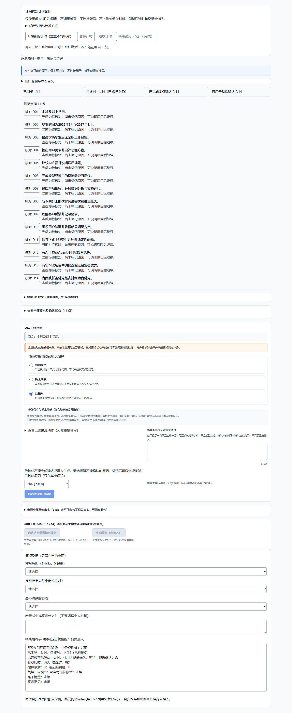
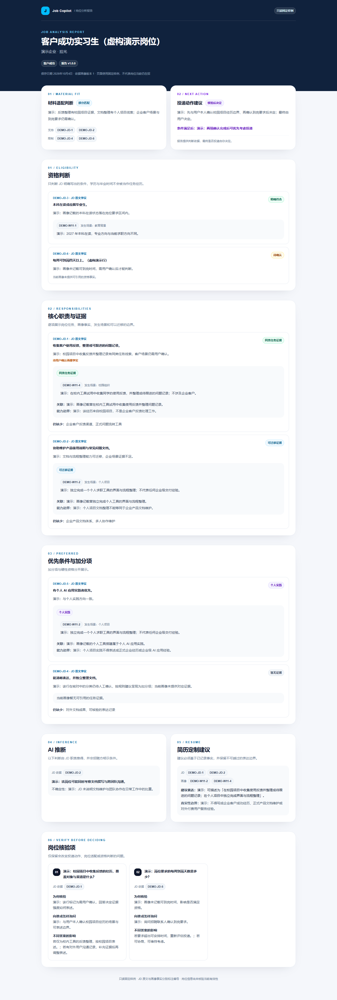

# Job Copilot · AI 求职决策与管理

> **工程作品快照 · 开发暂缓 · 尚未作为完整产品上线。**
> 本仓库用于展示需求取舍、证据约束、Agent 协作开发与工程验收。真实生成按钮仍关闭，完整 v2 流程及报告质量尚未验收。

Job Copilot 从求职中的实际问题出发：背景资料重复提供、JD 要求与经历证据混在一起、分析与投递进度相互分离。目标是保存真实画像，核对岗位要求，产生可追溯的匹配和简历建议，再管理投递行动。

**快速阅读：** [当前进度](docs/STATUS.md) · [架构](docs/ARCHITECTURE.md) · [产品决策](docs/PRODUCT.md) · [验证与限制](docs/VERIFICATION.md) · [协作过程](docs/COLLABORATION.md) · [公开范围](docs/PUBLICATION.md)

## 页面截图

下列截图取自虚构材料的本地展示，不能作为真实用户结果或模型质量通过的证据。




## 技术栈

Next.js 16 / React 19 / TypeScript 5.9 / Tailwind CSS 4 / Supabase Auth 与 PostgreSQL / pgmq 队列 / Edge Worker / DeepSeek API 服务端适配器。模型密钥留在服务端。

## 当前能力与边界

| 模块 | 开发与验收状态 |
| --- | --- |
| 登录、画像、JD 草稿核对 | 已实现真实 HTTP 流程，并有历史测试环境验收记录 |
| 生成幂等、状态恢复、本人报告读取 | 已实现；固定样例链路及访问边界做过验收 |
| 异步队列、Worker、Cron 唤醒 | 固定样例自动消费曾通过；当前 Cron 停用、真实模型模式关闭 |
| DeepSeek 报告质量 | 做过真实调用；部分输出被校验拒绝，部分被人工拒绝，质量尚未最终通过 |
| 证据计划和完整报告 v2 | 领域逻辑、解析和虚构报告已实现；十份迁移已进入专用测试项目 |
| v2 数据库完整验收 | r8 创建计划通过，但 concurrent-replay 组合断言失败；后续矩阵未执行 |
| 投递记录与 Dashboard | 展示样例；真实 CRUD 和统计闭环尚未完成 |
| 公开生产部署 | 未完成 |

## 本地查看

使用 Node.js 24，建议固定在已验证的 24.21.x：

```bash
npm ci
npm run dev
```

打开 `http://localhost:3000`，可以浏览 `/analyses`、`/jd-review-demo`、`/profile-fields-demo`、`/applications` 和 `/evidence-plan-trial` 的展示内容。它们的展示样例不需要模型 Key；试用页使用内存状态，刷新不代表服务器恢复。

```bash
npm test
npm run typecheck
npm run build
```

公开测试集合只含虚构材料和本地 mock，**不等于原开发仓库的完整测试集合，也不替代真实数据库或模型验收**。远程验收的历史结果见 [VERIFICATION](docs/VERIFICATION.md)。

## 目录

```text
src/app/               页面与现有 v1 API
src/lib/analysis/      模型适配、幂等、队列及 Worker 逻辑
src/lib/report/        v1 结构和证据规则
src/lib/report-v2/     完整 v2 manifest、组装、解析与校验
src/lib/evidence-plan/ 证据核对与计划领域逻辑
src/types/             数据与页面契约
src/fixtures/          公开版虚构样例
supabase/migrations/   十份开发迁移
supabase/functions/    Worker 入口
tests/                 公开的虚构回归集合
docs/                  作品集说明及截图
```

## 人与 Agent 的职责

用户负责场景选择、功能取舍、试用反馈和最终报告质量判断。Codex 负责核心架构、数据与权限、模型和证据规则、复杂调试与集成审查。WorkBuddy 参与边界明确的展示组件和 Mock 页面实现。[贡献说明](AUTHORS.md)

## 开发暂停与恢复

当前优先用于求职展示，后续根据用户反馈决定投入。恢复时首先定位 r8 并发重放的具体失败断言，再完成 v2 数据库矩阵、HTTP/Worker 接线、三类 JD 真实质量验收及生产部署。

这是从开发提交 `7fdac9309767e6360bad996dd596919ae605781f` 整理出的公开快照；私有 Git 历史、真实评测资料及原始审计没有上传。原开发仓库保留用于后续恢复。个人网站在 [portfolio-site](https://github.com/jiuyier369-design/portfolio-site) 独立维护，两者目前仅通过链接关联。

本仓库暂未授予开源许可证；公开展示与授权再利用是两件事。后续由项目所有者决定许可证。
