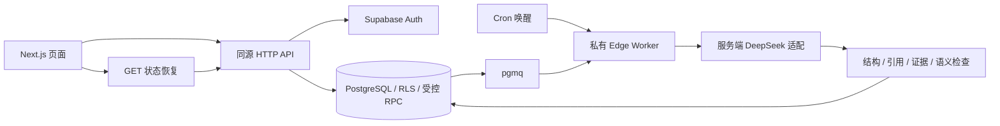

# 架构与证据边界

历史报告保存画像、JD 确认快照及版本，阻止当前画像变化覆盖旧报告。模型调用有幂等 requestId 与指纹；结果不明进入 uncertain，并通过 GET 查询，不能自动另发收费调用。

v2 计划与操作回执使用 operationId；它与生成 requestId 不同。计划绑定用户、JD 确认版本、画像版本和来源摘要。完整报告 v2 使用独立 manifest/schema/parser，不能送给旧解析器。

图中异步底座主要是已有 v1 流程。v2 的真实 HTTP、Worker 及保存事务接线尚未完成；数据库完整验收也仍有 r8 阻塞。

公开源码中的专用测试项目标识已替换为虚构标识，测试 Worker 的目标保护不能直接用于生产配置。请勿把这些脚本视为一键生产部署工具。
